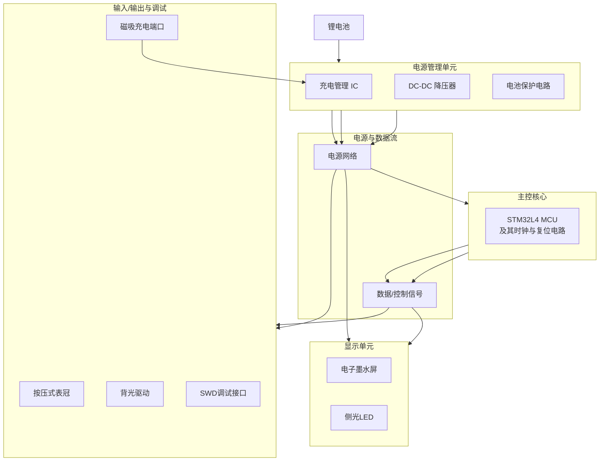

```mermaid
flowchart TD
    subgraph 电源与数据流
        direction LR
        PWR[电源网络]
        SIG[数据/控制信号]
    end

    BATT[锂电池] --> PMU
    subgraph PMU [电源管理单元]
        CHG[充电管理 IC]
        DCDC[DC-DC 降压器]
        PROT[电池保护电路]
    end

    PMU --> PWR --> MCU
    PMU --> PWR --> DISP
    PMU --> PWR --> IO

    MCU --> SIG --> DISP
    MCU --> SIG --> IO

    subgraph MCU [主控核心]
        STM32[STM32L4 MCU<br>及其时钟与复位电路]
    end

    subgraph DISP [显示单元]
        EINK[电子墨水屏]
        LED[侧光LED]
    end

    subgraph IO [输入/输出与调试]
        BUTTON[按压式表冠]
        LED_CTRL[背光驱动]
        CHG_PORT[磁吸充电端口]
        DEBUG[SWD调试接口]
    end

    CHG_PORT --> CHG
```