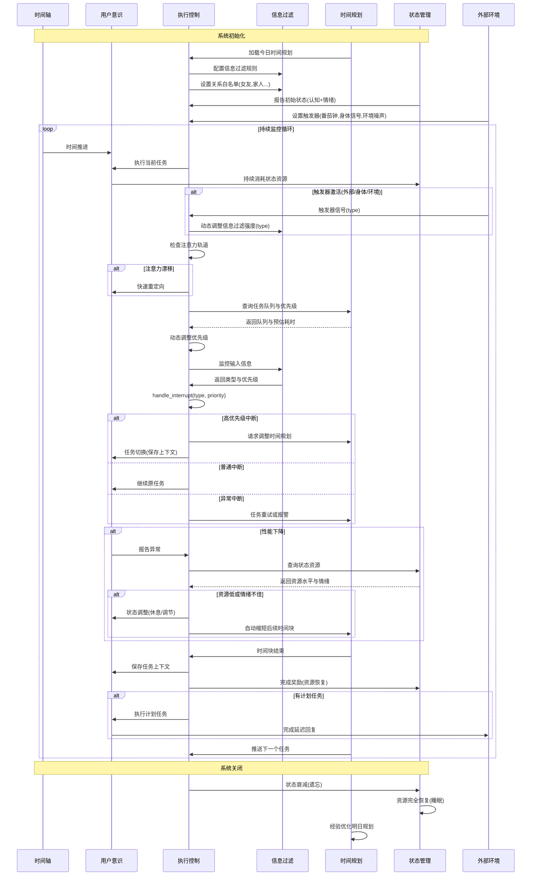

注意力的管理流程

---

### 生活化箭头说明举例

- TM->>EC: 加载今日时间规划
  - 例：早上起床后查看日程 App，决定上午先学习嵌入式，下午健身。
- EC->>IF: 配置信息过滤规则
  - 例：开启勿扰模式，屏蔽社交软件通知，只允许工作相关消息弹出。
- EC->>IF: 设置关系白名单(女友,家人...)
  - 例：设置女友和家人的微信为优先通知，其他人消息延后处理。
- SM->>EC: 报告初始状态(认知+情绪)
  - 例：刚睡醒，精力充沛，心情愉快，适合处理复杂任务。
- ENV->>EC: 设置触发器(番茄钟,身体信号,环境噪声)
  - 例：设置 25 分钟番茄钟，戴耳机屏蔽噪音，关注身体疲劳信号。
- T->>U: 时间推进
  - 例：上午 9 点到 10 点，专注学习，时间每过一小时提醒一次。
- EC->>U: 执行当前任务
  - 例：开始写代码，专注于嵌入式驱动开发。
- U->>SM: 持续消耗状态资源
  - 例：连续学习 2 小时后，感觉注意力下降，精力消耗明显。
- ENV->>EC: 触发器信号(type)
  - 例：番茄钟响起，或身体感到疲劳，提醒休息。
- EC->>IF: 动态调整信息过滤强度(type)
  - 例：休息时允许更多娱乐信息弹出，工作时只保留重要通知。
- EC->>EC: 检查注意力轨道
  - 例：发现自己刷手机，主动拉回注意力到学习任务。
- EC->>U: 快速重定向
  - 例：用“深呼吸+自我提醒”快速回到工作状态。
- EC->>TM: 查询任务队列与优先级
  - 例：临时收到导师任务，调整优先级，把导师任务提前。
- TM-->>EC: 返回队列与预估耗时
  - 例：预计导师任务需 30 分钟，原计划任务顺延。
- EC->>EC: 动态调整优先级
  - 例：根据紧急程度，随时调整任务顺序。
- EC->>IF: 监控输入信息
  - 例：实时监控微信、邮件等输入，判断是否需要打断当前任务。
- IF->>EC: 返回类型与优先级
  - 例：女友消息为高优先级，广告为低优先级。
- EC->>EC: handle_interrupt(type, priority)
  - 例：收到女友消息，暂停当前任务，快速回复。
- EC->>TM: 请求调整时间规划
  - 例：因突发任务，重新安排下午时间。
- EC->>U: 任务切换(保存上下文)
  - 例：暂停代码编写，转而处理导师临时任务，记录切换点。
- EC->>U: 继续原任务
  - 例：中断结束后，恢复到原来的学习任务。
- EC->>TM: 任务重试或报警
  - 例：遇到 bug 无法解决，记录问题，计划稍后重试或寻求帮助。
- U->>EC: 报告异常
  - 例：注意力涣散、理解困难时，主动反馈需要休息。
- EC->>SM: 查询状态资源
  - 例：检测精力和情绪是否适合继续高强度任务。
- SM-->>EC: 返回资源水平与情绪
  - 例：精力低、情绪不佳时建议休息。
- EC->>U: 状态调整(休息/调节)
  - 例：短暂休息、喝水、冥想，恢复状态。
- EC->>TM: 自动缩短后续时间块
  - 例：状态不佳时，自动将下一个任务时间缩短。
- TM->>EC: 时间块结束
  - 例：番茄钟结束，进入休息环节。
- EC->>U: 保存任务上下文
  - 例：记录当前进度，方便下次继续。
- EC->>SM: 完成奖励(资源恢复)
  - 例：完成一个任务后，奖励自己休息或吃点零食。
- EC->>U: 执行计划任务
  - 例：如约回复女友消息，完成承诺。
- U->>ENV: 完成延迟回复
  - 例：向女友发送“刚忙完，现在回复你”。
- TM->>EC: 推送下一个任务
  - 例：休息后自动提醒进入下一个学习任务。
- EC->>SM: 状态衰减(遗忘)
  - 例：一天结束，情绪和精力自然衰减。
- SM->>SM: 资源完全恢复(睡眠)
  - 例：晚上睡觉，第二天精力满格。
- TM->>TM: 经验优化明日规划
  - 例：根据当天效率，调整明天的学习和休息安排。
