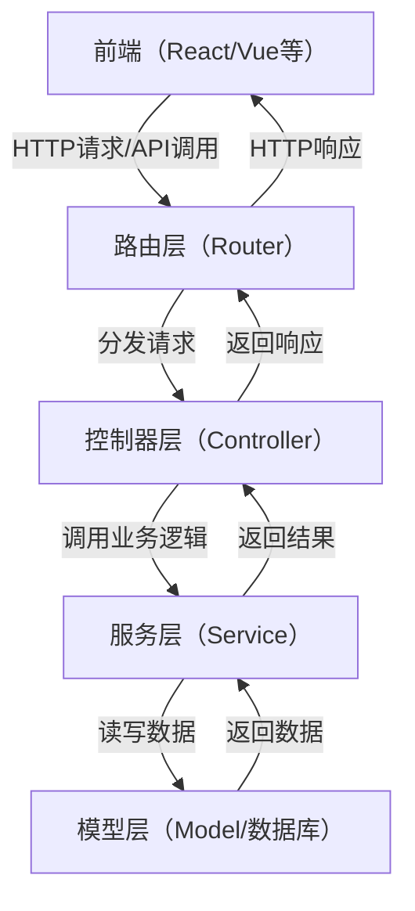
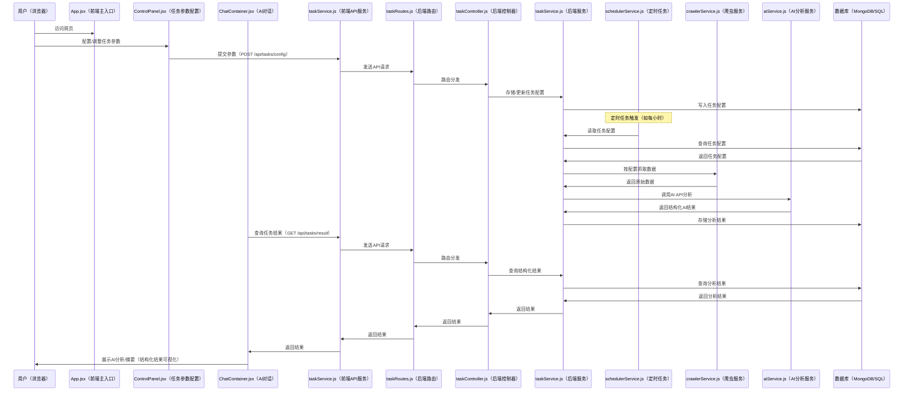

本文是对于 jobtry1 仓库内内容的总结

# ai 项目的经验教训

从一开始就出现了问题

需求制定-->技术选型-->具体实现-->测试反馈-->新的需求(循环)

总体上来说应该是遵循这样的流程来进行项目开发,而这在我刚开始时是不知道的
需求制定工作由项目要求给定了,我应该立即准备开始结合需求进行技术选型,一开始却去分析需求的需求,过分解读成对开源情报的搜取工作,这就太宽泛了.并不能仗着 ACD 过程尽情发挥,而是有约束和极限的发挥,这约束就是回到落实需求文档上.

技术选型上可以先选择简单和兼容性高的,便于后期迭代替换.第一次的 grawlee.js 是错误选型,第二次的 cheerio 是正确的.
在这里粘贴一下 ai 的总结:
技术选型时应重点考虑以下要素：

- 需求适配度：能否满足当前和未来的核心业务需求。
- 团队熟悉度：团队成员对该技术的掌握程度，影响开发效率和维护难度。
- 社区与生态：文档、社区活跃度、第三方库和工具的丰富性。
- 性能与扩展性：在目标场景下的表现及未来扩展的便利性。
- 兼容性与可替换性：与现有系统的集成难度，以及后续替换的灵活性。
- 成本：包括开发、运维、授权等直接和间接成本。
- 安全性与稳定性：安全漏洞历史、长期维护和更新情况。

通用参考指标有：

- 官方文档和社区活跃度
- Github star/issue/更新频率
- 典型案例和大厂采用情况
- 性能基准测试数据
  我认为对于单人初期开发,需求适配,扩展兼容性,开发学习成本,最近更新频率这四项是要重点考虑的.

技术选型层面应该采用最优质的 ai 模型进行设计

具体实现:就前后端项目而言:大胆质疑,小心求证,不论大模型评测智商几何,我的上下文理解能力目前还是超越 ai 的,紧贴需求,把握信息流动方向,保持清醒的头脑.

1. 我们要有时序图说明信号流动的方向,or 信号流图,这里的初期指导图就是一个很好的示例
2. 根据时序图自上而下顺序,实现前后端功能
3. 根据时序图首先建立文件夹和文件结构,然后再进行具体实现
4. 分主子模块实现,每次 ai 对话轮只实现一个模块,子模块的实现以主模块作为上下文参考
5. 每次实现一层数据流动就进行测试确保正确(backend 目录里的测试程序是一个很好的示例)
6. 测试反馈时,要有测试用例,并且要有测试结果的记录
7. 注意测试反馈后出现的新需求的循环,尽量防止冗余和耦合

关于提问:

1. 应该如何,实际如何,怎样如何
2. 前端的问题:先在 F12 中定位错误位置,再向 ai 反馈(以上面的形式)
3. 后端的问题:先在终端和数据库中掌握错误信息,再向 ai 反馈(以上面的形式)

绝对要避免的事情:

1. 一次生成大量(上千行)未经阅读的代码
2. 任由 ai 引导自己修改而不是反过来
3. 表达含糊不清的或者笼统庞大的问题



```js
// 停止所有任务的定时调度（除指定任务外）
export const stopAllOtherTaskSchedules = async (exceptTaskId) => {
	const tasks = await Task.find();
	for (const task of tasks) {
		if (task._id.toString() !== exceptTaskId.toString()) {
			await schedulerService.stopTaskSchedule(task);
			task.status = "stopped";
			task.enableScheduler = false;
			await task.save();
		}
	}
};
```


