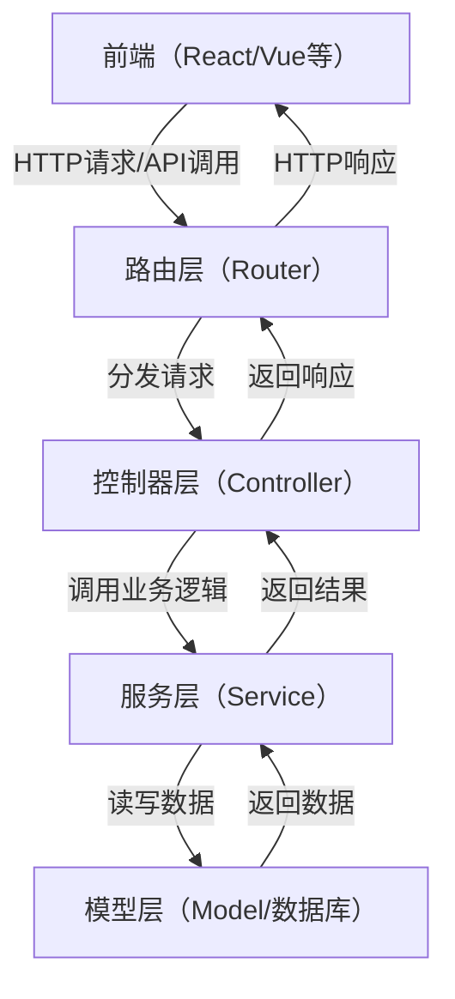

```js
// 停止所有任务的定时调度（除指定任务外）
export const stopAllOtherTaskSchedules = async (exceptTaskId) => {
	const tasks = await Task.find();
	for (const task of tasks) {
		if (task._id.toString() !== exceptTaskId.toString()) {
			await schedulerService.stopTaskSchedule(task);
			task.status = "stopped";
			task.enableScheduler = false;
			await task.save();
		}
	}
};
```