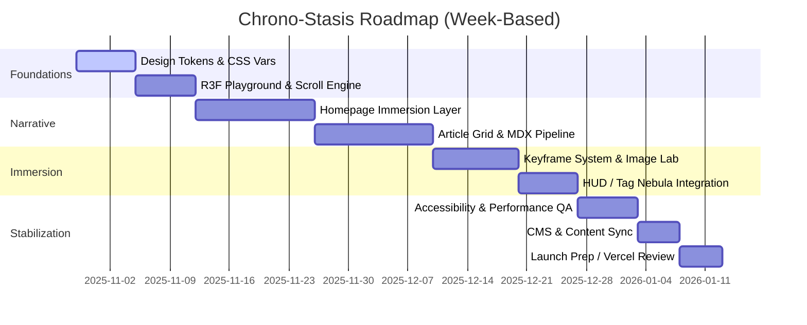

### Chrono-Stasis 实现方案（技术选型 & 脚手架计划）

#### 1. 项目总体策略

- 建立在 Next.js 15（App Router + React 19 + TypeScript 5.x）之上的全栈架构，充分利用 Vercel 原生优势（Edge Functions、ISR、Server Actions、图像优化、缓存策略）。
- 采用模块化单仓（monorepo）思路：主站 + 动效/渲染子包 + 设计 token，共用 `pnpm` 工作区与 Nx/Turborepo 任务编排，利于多人协作与 CI 并行。
- 渐进增强：首屏 SSR/SSG，进入互动区块时按需激活 WebGL、音效、滚动驱动动画；对低性能设备自动降级。
- 内容形态以 MDX + Headless CMS 并存：快速迭代阶段使用 MDX 驱动；后续接入 Sanity（或 Hygraph）实现结构化数据与协作工作流；通过 Contentlayer 统一接口。

#### 2. 技术选型明细

- **前端框架**：Next.js 15（App Router），React Server Components + Client Components 混合。
- **语言 & 工具链**：TypeScript 5.x、ESLint（Next 官方规则 + 自定义动效 lint）、Prettier、Commitlint/Conventional Commits。
- **包管理与构建**：`pnpm` + Turborepo；Development 使用 Turbopack，CI 构建沿用 Next 构建任务。
- **渲染与动效**：`three`、`@react-three/fiber`、`@react-three/drei`、`postprocessing`、`framer-motion`、`gsap`（时间线）、`lenis`（滚动平滑）、`leva`（调试面板）。
- **样式体系**：CSS Modules + CSS Variables 搭配 `vanilla-extract`（定义设计 token）、`tailwindcss`（快速布网与响应式语义类）；Radix UI primitives 作为无障碍组件基底。
- **内容层**：Contentlayer + MDX（短期）；Sanity + `next-sanity`（中期，可通过 ENV 切换）；全局使用自定义 `MDXComponents` 实现 Scene/Keyframe/Dialogue 等模块。
- **状态管理**：`zustand`（偏 UI 状态）、React Context（动效首选项、音效开关）；数据层使用 Next 内置 fetch cache + React Query 处理客户端交互数据。
- **音效 & 多媒体**：`tone.js`（背景氛围）、`howler.js`（短音效）；Web Audio API Hook；移动端封装振动 API。
- **图像/资产处理**：Next Image、`sharp`、`glslify` loader（着色器）、`lottie-react`/`rive-react`（Logo/HUD）。
- **测试体系**：Vitest（单测 + 组件）、Playwright（E2E、动效断言）、Lighthouse CI（性能回归）、Chromatic（Storybook 可视回归）。
- **监控与分析**：Vercel Analytics、Sentry（前端 + Edge）、Amplitude（交互事件）。
- **部署与运维**：Vercel（Preview/Production）；GitHub Actions 驱动 lint/test/storybook 构建；使用 Vercel 环境变量管理密钥。

#### 3. 脚手架搭建步骤

1. **初始化仓库**
   - `pnpm init` → 新建 `pnpm-workspace.yaml` 定义 packages：`apps/web`、`packages/ui`、`packages/motion`、`packages/tokens`。
   - 引入 Turborepo：`pnpm add -D turbo`，配置 `turbo.json`（lint/test/build/storybook pipelines）。
   - 添加 git hooks：Husky + lint-staged + commitlint。

2. **Next.js 应用基座（apps/web）**
   - `pnpm create next-app --example with-turbo --typescript` 或使用 `create-next-app@latest` 后迁入 monorepo。
   - 启用 App Router、`experimental.serverActions`、`typedRoutes`、` instrumentationHook`。
   - 配置 `next.config.mjs`：开启 `images.remotePatterns`、`webpack` 自定义（GLSL loader、three.js alias、build output tracing）。
   - 设置 `tsconfig.json` 基础路径别名（`@ui/*`, `@motion/*`, `@tokens/*`）。

3. **UI 设计系统（packages/ui）**
   - `vanilla-extract` + `tailwindcss` + `postcss`；抽象栅格、色板、排印、HUD 元件。
   - 引入 Radix Primitives + 自定义组件（导航 HUD、Tag Nebula、Cinematic Header、Timeline Beacon）。
   - 建 Storybook 8 支持（Vite builder），与设计 token 同步。

4. **动效与渲染引擎（packages/motion）**
   - 封装 `three` 场景、R3F 组件（粒子云、光束、关键帧播放器、Glitch Shader）。
   - 提供统一 hooks（`useParallaxScene`, `useAudioReactiveShader`, `useReducedMotionGuard`）。
   - 维护 `gsap` 时间线配置预设，导出用于页面级动画。

5. **设计 Token（packages/tokens）**
   - 使用 `vanilla-extract` createTheme + `style-dictionary` 输出多格式（CSS vars、JSON、TS）。
   - 定义色彩、排版、间距、动效节奏、阴影、噪点强度、GLSL 常量。

6. **内容层接入**
   - 先集成 Contentlayer + MDX，定义文档 schema（frontmatter、动效配置、音效引用）。
   - 封装 `MDXComponents`（SceneParagraph、KeyframePlayer、DialogueCapsule、HolographicTerminal 等）。
   - 预留 CMS 接口：抽象 `getChronoEntries()`，可切换至 Sanity 数据源。

7. **系统功能实现基线**
   - **首页**：Preloader（R3F + 音效）、动态背景（点云 shader）、Slogan 动效（shaderMaterial）、入口按钮（Framer Motion + GSAP timeline）、音效控制器。
   - **文章列表**：非对称网格布局（CSS Grid + Tailwind utilities）、卡片 Hover 状态机（Framer Motion）、视差滚动（Lenis + Scroll-based uniforms）、过滤器面板（Radix Dialog + R3F 背景模糊）。
   - **详情页**：Cinematic Header（Intersection Observer 控制）、Scene Paragraph（MDX 渲染 + 动画）、Keyframe 模块（R3F scroll controls）、引用块（光束动画）、代码终端（Radix Tabs + copy hook）、Image Lab（Next Image + shader overlay）。
   - **全局模块**：HUD Menu（Radix Dialog + Motion）、Tag Nebula（R3F particle system）、评论面板（Headless UI + WebSocket/静态占位）、作者名片（动画边框）。

8. **可访问性与性能**
   - 实现动效总开关（`prefers-reduced-motion` + 用户偏好存储于 localStorage/zustand）。
   - 交互组件全部提供键盘支持、Focus 样式、电浆蓝高对比。
   - WebGL 场景懒加载（`dynamic(import, { ssr: false })` + `useInView`），低端设备降级为静态 Canvas/SVG。
   - 使用 `next/script` 控制第三方脚本；通过 `next/font` 引入自托管字体。

9. **测试与质量流程**
   - `pnpm lint`, `pnpm test`, `pnpm test:e2e`, `pnpm test:visual` Pipeline。
   - Storybook + Chromatic CI（PR 自动截图 diff）。
   - Playwright 针对核心动效（Preloader、关键帧模块、过滤器）编写场景脚本。
   - Lighthouse CI 集成（阈值：Performance ≥ 75, Accessibility ≥ 95, Best Practices ≥ 90, SEO ≥ 95）。

10. **部署流程（Vercel）**
    - 连接 GitHub 仓库，启用 Preview 环境；配置 `VERCEL_ENV`、`NEXT_PUBLIC_*`、`SANITY_*` 等环境变量。
    - `vercel.json` 定义 Edge/Serverless 函数路由、缓存策略（文章详情 ISR、主页静态预渲染）。
    - 通过 GitHub Actions 在 `main` 分支合并时运行 `pnpm turbo run lint test build`，成功后触发 Vercel Production 部署。
    - 使用 Vercel Analytics 与 Speed Insights 监控真实用户性能，结合 Sentry 追踪错误。

11. **后续扩展节点**

- 引入实时数据流（Supabase Realtime 或 Vercel Realtime）展示粒子化资讯。
- 开发 AI 叙事助手：结合 LangChain + Edge Functions，提供内容推荐与语音提示。
- 用户主题工坊：允许用户组合色板/动效参数，写入用户配置并通过 CSS Variables/Shader uniforms 实时切换。
- 多语言支持：使用 `@lingui/cli` 或 `next-intl`，处理中/英/日内容。
- Edge cache 策略微调：热门文章采用 ISR + revalidateTag，长尾内容 on-demand revalidate。

#### 12. 设计开发流程与进度路线

- 采用“双轨并行”策略：设计组维护 Figma + 动效原型，开发组按组件库 → 页面 → 叙事模块顺序实现；通过每周 Design/Dev Sync 调整优先级。
- 关键阶段里程碑：
  1.  **Foundations Sprint (Week 1-2)：** Token 定义、字体/色彩落地、基础布局与滚动系统；建立 Storybook 与 R3F Playground。
  2.  **Narrative Sprint (Week 3-5)：** 首页交互段落、文章列表状态机、MDX 模块；与设计同步动画标注与音效清单。
  3.  **Immersion Sprint (Week 6-7)：** 关键帧模块、Image Lab、HUD/Tag Nebula、无障碍调优、性能优化脚本。
  4.  **Stabilization (Week 8)：** Playwright/Lighthouse 回归、CMS 接入验证、Vercel Preview 审查、内容填充。
- 每个 Sprint 含：设计文档更新 → Dev Spike → 实装 → QA → Review；必要时安排技术 Spike（例如 WebGL shader 调优）。

- 每周交付物：更新 `实现方案.md` 状态栏、Storybook 里程碑、Vercel Preview 链接、Lighthouse 报表、关键动效录屏。
- 评审节奏：
  - 周中设计评审（聚焦视觉与动效匹配度）。
  - 周末 Dev Demo（演示新增模块、讨论技术风险与性能预算）。
- 风险与缓冲：预留 10% 时间处理 shader 调优、Sanity API 变动或浏览器兼容性差异；建立 Feature Flag 以便在上线前根据性能评估关闭高开销特效。
